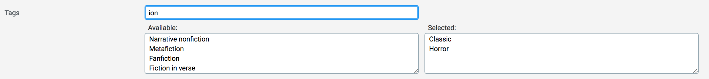

# ActiveAdmin Select Many 

An Active Admin plugin which improves one-to-many and many-to-many associations selection (jQuery required).

Features:
- search box
- select on the left with available items
- select on the right with selected items
- local/remote collections
- double click to add/remove items

## Install

- Add to your Gemfile:
`gem 'activeadmin_select_many'`
- Execute bundle
- Add at the end of your ActiveAdmin styles (_app/assets/stylesheets/active_admin.scss_):
`@import 'activeadmin/select_many';`
- Add at the end of your ActiveAdmin javascripts (_app/assets/javascripts/active_admin.js_):
`//= require activeadmin/select_many`
- Use the input with `as: :select_many` in Active Admin model conf

## Examples

Add to ActiveAdmin model config, in *form* block.

- Local collection (no AJAX calls):
`f.input :sections, as: :select_many`
- Remote collection (using AJAX):
`f.input :tags, as: :select_many, remote_collection: admin_tags_path( format: :json )`
- Changing search param and text key:
`f.input :tags, as: :select_many, remote_collection: admin_tags_path( format: :json ), search_param: 'category_contains', text_key: 'category', placeholder: 'Type something...'`

## Options

- **collection**: local collection
- **placeholder**: placeholder string for search box
- **remote_collection**: JSON path
- **search_param**: parameter to use as search key (ransack style)
- **text_key**: key to use as text for select options

## Do you like it? Star it!

If you use this component just star it. A developer is more motivated to improve a project when there is some interest.

## Contributors

- [Mattia Roccoberton](http://blocknot.es) - creator, maintainer

## License

[MIT](LICENSE.txt)
