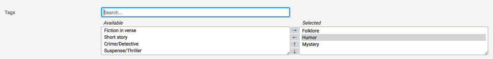

# ActiveAdmin Select Many
[](https://badge.fury.io/rb/activeadmin_select_many)
[](https://rubygems.org/gems/activeadmin_select_many)
[](https://github.com/blocknotes/activeadmin_select_many/actions/workflows/specs.yml)

An Active Admin plugin which improves one-to-many / many-to-many / many-to-one associations selection using 2 new inputs: **select_many** and **select_one** (jQuery required).

Features for *select_many*:

- search box;
- available items on the left, selected items on the right;
- local/remote collections;
- double click to add/remove items;
- sortable (with up/down buttons);
- key bindings to improve accessibility.

Features for *select_one*:

- search box;
- selected items on the right;
- remote collections;
- counter of items found;
- can be used as filter;
- key bindings to improve accessibility.



*(inspired by RailsAdmin associations selector)*

## Install

- Add to your Gemfile:
`gem 'activeadmin_select_many'`
- Execute bundle
- Add at the end of your ActiveAdmin styles (_app/assets/stylesheets/active_admin.scss_):
`@import 'activeadmin/select_many';`
- Add at the end of your ActiveAdmin javascripts (_app/assets/javascripts/active_admin.js_):
`//= require activeadmin/select_many`
- Use the input with `as: :select_many` in Active Admin model conf

## Options

- **collection**: local collection
- **counter_limit**: if results count is greater than or equal to this limit a '+' is shown
- **filter_form**: for *select_one* only, allow to use it as filter
- **include_blank**: for *select_one* only, default true, allow to include a blank value on top
- **member_label**: key to use as text for select options
- **placeholder**: placeholder string for search box
- **remote_collection**: JSON path
- **search_param**: parameter to use as search key (ransack format)
- **selected**: force value selection (array for *select_many*, single value for *select_one*)
- **size**: number of rows of both the selects (default: 4)
- **sortable**: set to true to enable sortable buttons (default: not set)

## Examples with select_many

Add to ActiveAdmin model config, in *form* block.

- Local collection (no AJAX calls):
`f.input :sections, as: :select_many`
- Remote collection (using AJAX):
`f.input :tags, as: :select_many, remote_collection: admin_tags_path( format: :json )`
- Changing search param and text key (default: *name*):
`f.input :tags, as: :select_many, remote_collection: admin_tags_path( format: :json ), search_param: 'category_contains', member_label: 'category', placeholder: 'Type something...'`
- Sortable (items position must be saved manually):
`f.input :tags, as: :select_many, remote_collection: admin_tags_path( format: :json ), sortable: true`

Example to update *position* field:

```rb
  after_save :on_after_save
  controller do
    def on_after_save( object )
      if params[:article][:section_ids]
        order = {}
        params[:article][:section_ids].each_with_index { |id, i| order[id.to_i] = i }
        object.sections.each { |item| item.update_column( :position, order[item.id].to_i ) }
      end
    end
  end
```

Example to enable JSON response on an ActiveAdmin model:

```rb
ActiveAdmin.register Tag do
  config.per_page = 30  # to limit served items
  config.sort_order = 'name_asc'
  index download_links: [:json]
end
```

## Examples with select_one

In a form:

`f.input :article, as: :select_one, placeholder: 'Search...', remote_collection: admin_articles_path( format: :json ), search_param: 'title_contains', member_label: 'title'`

As filter:

`filter :article_id_eq, as: :select_one, filter_form: true, placeholder: 'Search...', search_param: 'title_contains', member_label: 'title', remote_collection: '/admin/articles.json'`

## Notes

- To use this plugins with ActiveAdmin 1.x please use the version 0.3.4

## Do you like it? Star it!

If you use this component just star it. A developer is more motivated to improve a project when there is some interest. My other [Active Admin components](https://github.com/blocknotes?utf8=✓&tab=repositories&q=activeadmin&type=source).

Or consider offering me a coffee, it's a small thing but it is greatly appreciated: [about me](https://www.blocknot.es/about-me).

## Contributors

- [Mattia Roccoberton](http://blocknot.es): author

## License

[MIT](LICENSE.txt)
